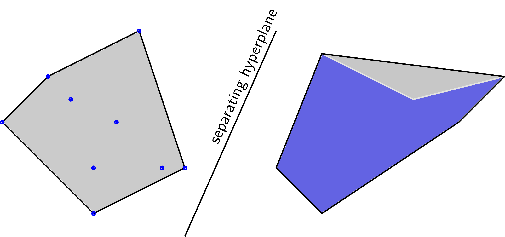

# Bài toán tối ưu hóa nguồn lực cho MKT

### Giới thiệu

Trong toán tối ưu, một bài toán thường được viết dưới dạng:

$$
x^* = arg min f_0(x) subject to: f_i(x)<=0, i=1,2,...,m
$$

$$
h_j(x)= 0, j = 1,2,..,p
$$

Trong đó vertor x được gọi là biến tối ưu \(optimization variable\). Hàm số f0 được gọi là hàm mục tiêu \(objective function, các hàm mục tiêu trong Machine learning thường được gọi là hàm mất mát\). Các hàm số fi, hj được gọi là các hàm ràng buộc - contraints. Tập hợp các điểm x thỏa mãn các ràng buộc được gọi là feasible set, mỗi điểm trong feasible set được gọi là là feasible point, các điểm không trong feasible set được gọi là infeasible points

**Chú ý**

* Nếu bài toán tìm giá trị lớn nhất chỉ cần đổi dấu f0\(x\)
* nếu ràng buộc là &gt;= tức fi\(x\) &gt;= bi, chỉ cần đổi dấu của ràng buộc : - fi\(x\) &lt;= -bi
* Nếu ràng buộc bằng nhau hj\(x\)=0 có thể viết dưới dạng 2 bất đẳng thức hj\(x\) &lt;= 0 và -hj\(x\)&lt;=0

Các bài toán tối ưu nhìn chung không có cách giải tổng quát, thậm chí có bài chưa có lời giải, hầu hết các phương pháp tìm nghiệm không chứng mình được nghiệm tìm được có phải là global optimal chưa, thay vào đó nghiệm thường là local optimal - các điểm cục trị.

Để bắt đầu học tối ưu, cần học một mảng quan trọng là tối ưu lồi \(convex optimization\), trong đó hàm mục tiêu là một hàm lồi \(convex function\), feasible set là một tập lồi \(convex set\).

## Convex Sets

### Định nghĩa 

**ĐN1**: một tập hợp được gọi là tập lồi \(convex set\) nếu đoạn thằng nối hai điểm bất kỳ trong tập hợp đó nằm trọn vẹn trọng tập hợp đó. Đường hoặc đoạn thằng cũng là một tập lồi theo định nghĩa phía trên.

Một vài ví dụ thực tế:

* 1 căn phòng cá dạng hình lồi thì nếu ta đặt 1 bóng đèn đủ sáng ở bất kỳ vị trí nào trong phòng, mọi điểm trong căn phòng đều được chiếu sáng
* 1 đất nước có bản đồ dạng hình lồi thì đường bay nối giữa hai thành phố bất kỳ trong đất nước đều nằm trọn vẹn trong không phận nước đó

**ĐN2**: một tập hợp C được gọi là Convex nếu với hai điểm bất kỳ x1, x2 ∈ C, điểm - đoạn thằng nối 2 điểm x1, x2:

$$
x_θ =θx_1+(1-θ)x_2
$$

cũng nằm trong C với bất kỳ 0 ≤ θ ≤ 1

### Ví dụ

* Hyperplanes và halfspaces
  * Hyperplanes \(siêu mặt phẳng\) trong không gian n chiều là tập hợp các điểm thỏa mãn phương trình là các tập lồi \(hình a.1\)
  * Halfspace \(nửa không gian\) trong không gian n chiều là tập hợp các điểm thỏa mãn bất phương trình \(hình a.2\)

$$
a_1x_1+a_2x_2+....+a_nx_n=a^tx=b
$$

$$
a_1x_1+a_2x_2+....+a_nx_n=a^tx≤b
$$

với b, ai, i = 1,2...,n

* Norm balls: euclidean balls hình tròn trong mặt phẳng, hình cầu trong không gian ba chiều 
* Ellipsoids: ellipse trong không gian nhiều chiều

### Giao của các tập lồi là 1 tập lồi

### Convex combination

Một điểm được gọi là convex combination \(tổ hợp lồi\) của các điểm x1, x2, xk nếu có thể viết được dưới dạng

$$
x = θ_1x_1+θ_2x_2+...+θ_kx_k with θ_1+θ_2+...+θ_k=1
$$

Convex hull của một tập hợp bất kỳ là tập hợp tất cả các điểm là convex combination của tập hợp đó. Convex hull là một convex set. Convex hull của 1 convex set là chính nó hay convex hull của 1 tập hợp là 1 convex set nhỏ nhất chứa tập hợp đó.

Hai tập hợp được gọi là linearly separable nếu các convex hulls của chúng không có điể chung

## Convex functions

### Định nghĩ

### a

